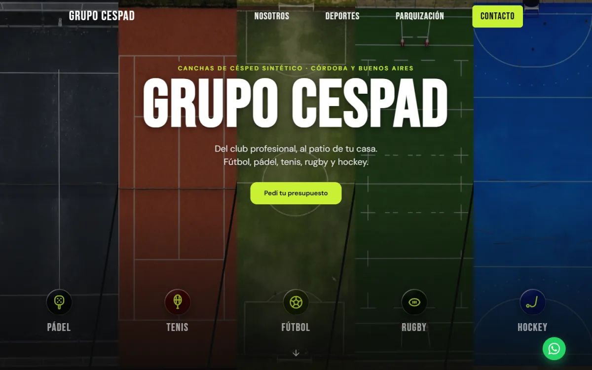
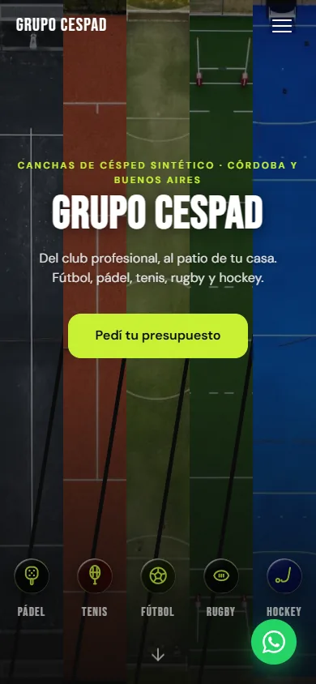

# Grupo CESPAD — landing

Landing de una empresa de canchas de césped sintético y parquización que opera
desde Córdoba a todo el país. La hice yo, de cero, sin framework y sin build
step: se sirve tal cual está en el repo.

La conversión del sitio es una sola: que el visitante abra WhatsApp. No hay
checkout ni reserva online, así que todo está ordenado para acortar ese camino.

**[Ver en vivo](https://grupo-cespad-actualizacion.vercel.app/)** · dominio
propio pendiente de compra

| Desktop | Mobile |
|---|---|
|  |  |

## Por qué sin framework

El sitio es una landing de una sola página con cinco módulos de interacción.
Meter React acá significaba sumar un build step, un bundle y un paso de deploy
para resolver problemas que no tengo. HTML + CSS + JS vanilla me dejó el control
fino sobre el orden de carga, que es donde se juega el PageSpeed, y el proyecto
lo va a mantener alguien que no necesariamente sabe npm.

## Stack

HTML5 semántico, CSS3 con custom properties, JS vanilla en IIFEs. Deploy en
Vercel, una preview por rama. Fuentes: Bebas Neue + DM Sans.

Cada módulo de `main.js` hace early-return si su markup no existe, así que se
puede borrar una sección entera del HTML sin romper el resto. El número de
WhatsApp vive en un solo objeto `CONFIG` y de ahí sale el FAB, el teléfono
visible, los botones de cada deporte y el mensaje que arma el formulario.

## Performance

De 12.6 MB de payload inicial a ~3 MB. **92 en mobile, 90 en desktop.**

Lo que más movió la aguja, en orden:

- Recompresión de todas las imágenes a WebP con presets distintos por uso
  (texturas a 200px q78, fotos de cancha a 1200px q80, aéreas a 900px q75).
  Los originales quedan versionados aparte para poder rehacerlo.
- CSS crítico del above-the-fold inline en el `<head>` y `styles.css` diferido.
- Preload del LCP y de las dos woff2 que se ven arriba de todo.
- `content-visibility` en las secciones de abajo.
- `width` y `height` reales en cada `` para no pagar CLS.

El CLS de desktop quedó en 0.191 y lo dejé así a propósito: el fix pasa por
`size-adjust` o self-hosting de fuentes, y el tráfico real de este negocio es
mobile.

## Lo que me parece más interesante del código

**Hero de cinco paneles.** Cinco fotos aéreas, una por deporte. Cada una es un
`` real y no un `background-image`, justamente para que el preload scanner
las agarre antes de leer el CSS. Tocar un ícono activa el tab del deporte
correspondiente y baja a la sección: dos clics hasta WhatsApp.

**Tabs de Deportes.** Patrón ARIA completo con roving tabindex, navegación por
flechas y prefetch de la foto al pasar el mouse. Tres listeners delegados en
lugar de diecisiete individuales: agregar un deporte es markup, no JS.

**Swatches de color de césped.** Un configurador de producto en miniatura:
cambiás el color y cambia la foto de la cancha. Los colores disponibles varían
por deporte y también salen del markup.

**Sistema de superficies.** Seis tokens en `:root` componen todas las piezas
translúcidas: ruido de superficie, reflejo especular, canto, filtro y dos
relieves opuestos. El sistema distingue superficie elevada (lo que flota:
tarjetas, tabs, botones sobre foto) de superficie hundida (lo que recibe algo:
inputs y el panel de swatches), y esa distinción es lo único que separa a una
de otra. El canto es un `::before` con `mask-composite`, porque un degradé no
entra en `border`. Con fallback para navegadores sin `mask-composite` y sin
`backdrop-filter`.

**Escala tipográfica.** Diez escalones en tokens, de 12px a 48px. Los títulos
de sección van aparte, en dos pesos fluidos: el grande para las secciones donde
el visitante decide algo y el chico para las que argumentan a favor de esa
decisión. Antes de tokenizar había 29 tamaños sueltos, y once de ellos caían
entre 11 y 15px, o sea diferencias que nadie distingue.

**Carrusel de parquización.** Flechas en desktop, swipe en mobile con
resistencia en las puntas. Los dots los arma el JS según cuántas slides haya,
así que sumar una foto es un `<li>` más.

## Accesibilidad

Skip link, `:focus-visible` con outline de 3px en todo el sitio, targets de
44px, ARIA completo en los tabs, navegación por teclado, `prefers-reduced-motion`
respetado y contraste AA verificado sobre las superficies reales (medí el pixel
detrás del texto, no el valor del token).

## Estructura

```
index.html      markup + sprite SVG + CSS crítico inline
styles.css      hoja principal, índice numerado arriba del archivo
main.js         módulos IIFE independientes
img/            webp servidos
img/_originales/ fuentes de recompresión, no se sirven
```

Ojo con una cosa: el CSS crítico inline duplica a propósito reglas del header y
del hero que también están en `styles.css`. Si tocás una, tocá la otra.

## Estado

En desarrollo. Hay secciones que existen en el HTML pero están con `[hidden]`
esperando contenido real: proyectos, testimonios y las métricas de la empresa.
Preferí dejarlas escritas y apagadas antes que publicar números inventados.

## Licencia

MIT
